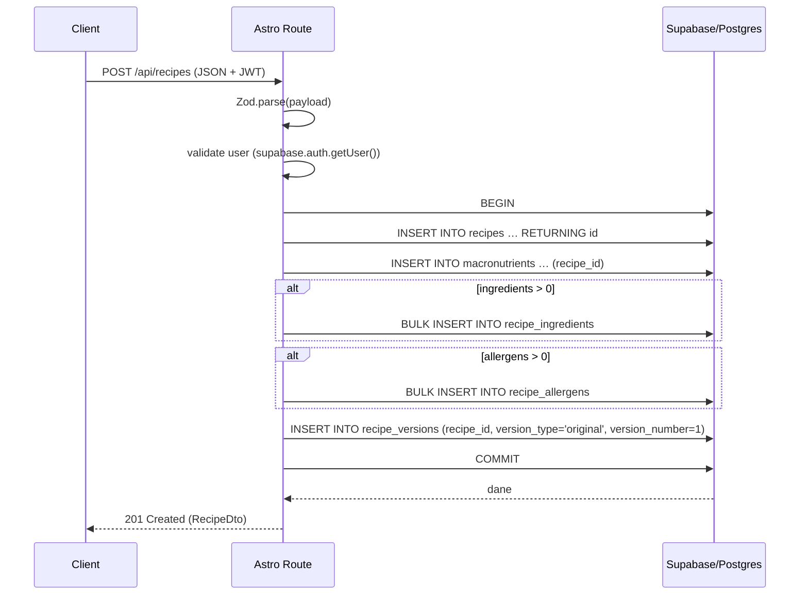

# API Endpoint Implementation Plan: POST /recipes

## 1. Przegląd punktu końcowego

Tworzy nowy przepis powiązany z zalogowanym użytkownikiem. Endpoint realizuje atomowo (w jednej transakcji):

1. Walidację payloadu.
2. Utworzenie rekordu w `recipes`.
3. Zapis makroskładników w `macronutrients`.
4. Zapis powiązań składników w `recipe_ingredients`.
5. Zapis powiązań alergenów w `recipe_allergens`.
6. Utworzenie wersji **original** w `recipe_versions`.
7. Zwrócenie kompletnego obiektu przepisu.

## 2. Szczegóły żądania

- **Metoda HTTP:** `POST`
- **URL:** `/api/recipes` (plik: `src/pages/api/recipes.ts`)
- **Nagłówki obowiązkowe:**
  - `Authorization: Bearer <JWT>` – token Supabase Auth.
  - `Content-Type: application/json`.
- **Body (CreateRecipeCommand):**
  ```json
  {
    "title": "string",
    "description": "string",
    "ingredients": [{ "ingredient_id": 1, "quantity": 50, "unit": "g" }],
    "macronutrients": { "calories": 450, "protein": 25, "carbs": 5, "fats": 35 },
    "allergens": ["peanuts"]
  }
  ```
- **Wymagane pola:** wszystkie z powyższych (lista może być pusta, ale pole musi istnieć).
- **Opcjonalne pola:** brak.

## 3. Wykorzystywane typy

- **Command:** `CreateRecipeCommand` (z `src/types.ts`).
- **DTO odpowiedzi:** `RecipeDto`.
- **Typy pomocnicze:** `RecipeIngredientInput`, `MacronutrientsCommand`, `IngredientDto`, `MacronutrientsDto`.

## 4. Szczegóły odpowiedzi

| Kod | Scenariusz                        | Treść                                            |
| --- | --------------------------------- | ------------------------------------------------ |
| 201 | Utworzono                         | `RecipeDto` – pełny obiekt przepisu              |
| 400 | Błędne dane                       | `{ "error": "ValidationError", "message": "…" }` |
| 401 | Brak/niepoprawny JWT              | `{ "error": "Unauthorized", "message": "…" }`    |
| 404 | Nie znaleziono składnika/alergenu | `{ "error": "NotFound", "message": "…" }`        |
| 500 | Błąd serwera                      | `{ "error": "ServerError", "message": "…" }`     |

## 5. Przepływ danych



## 6. Względy bezpieczeństwa

1. **Uwierzytelnienie:** Supabase JWT.
2. **Autoryzacja:** RLS "Users can create their own recipes" + brak `user_id` w payloadzie.
3. **Walidacja:** Zod – długości tekstów, wartości ≥0, ograniczenie liczby składników/alergenów (np. ≤100).
4. **SQL Injection:** Supabase parametryzowane zapytania / RPC.
5. **Rate limiting:** middleware (`src/middleware/rate-limit.ts`).
6. **Limit rozmiaru payloadu:** 1 MB.

## 7. Obsługa błędów

| Scenariusz                     | Kod | Akcja                                                          |
| ------------------------------ | --- | -------------------------------------------------------------- |
| ZodError                       | 400 | Zwróć szczegóły `.flatten()`                                   |
| Brak JWT                       | 401 | `Unauthorized`                                                 |
| Nieistniejący składnik/alergen | 404 | Wcześniejszy SELECT lub sprawdzenie liczby wstawionych wierszy |
| Błąd transakcji                | 500 | Zaloguj, zwróć `ServerError`                                   |
| Rate limit                     | 429 | Middleware zwróci błąd                                         |

## 8. Rozważania dotyczące wydajności

- **Bulk insert** zmniejsza RTT.
- **Jedno `SELECT`** do pobrania mapowania `allergen name -> id` (jeśli klient wysyła nazwy zamiast id).
- **Edge Function/SQL RPC** może skrócić czas – opcjonalnie.
- Indeksy już istnieją.

## 9. Etapy wdrożenia

1. **Schema Zod** `src/lib/schemas/recipes.ts` – `createRecipeSchema`.
2. **Service** `src/lib/services/recipes.service.ts`:
   ```ts
   export async function createRecipe(
     cmd: CreateRecipeCommand,
     supabase: SupabaseClient<Database>,
     userId: string
   ): Promise<RecipeDto> {
     /* … */
   }
   ```
3. **API route** `src/pages/api/recipes.ts`:
   - `export const prerender = false;`
   - Pobierz `supabase` z `context.locals`.
   - `const body = await context.request.json();`
   - `createRecipeSchema.parse(body)`.
   - `const { data: { user } } = await supabase.auth.getUser();`
   - `const dto = await createRecipe(body, supabase, user.id);`
   - `return new Response(JSON.stringify(dto), { status: 201 });`
